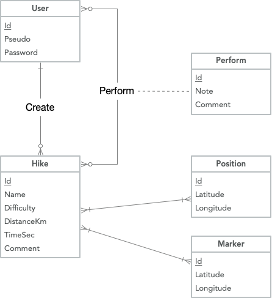

# Dev_Android_TP5

## Clone

* http:
  * git clone https://gitedu.hesge.ch/quentin.berthet1/dev_android_tp5.git
* ssh:
  * git clone ssh://git@ssh.hesge.ch:10572/quentin.berthet1/dev_android_tp5.git

## Modules

* API Google Maps
* ORM Ktorm
* BCrypt

## MCD

  

## Run

* Ouvrir le projet Android Studio "dev_android_tp5"
* Quand le projet est chargé, exécutez-le avec l'émulateur ou sur votre appareil Android
* Activez la géolocalisation du téléphone

## Informations

1. L'application est dispnible en anglais et en français, durant la description de l'utilisation de l'application, les boutons ferons références à la traduction française.
2. Il est possible de changer la langue du téléphone dans `Paramètres > Systèmes > Langues et saisie > Langues`

## Utilisation

A la première utilisation, vous arez besoin de créer un compte
  * Dans l'onglet "Inscription", choisissez un pseudo, un mot de passe.
  * Après l'inscription, vous devez vous connecter via l'onglet "Connexion" en rentrant le pseudo et le mot de passe précédemment choisis.

Dans le menu choisir entre :
1. Repertoires
2. Nouvelle randonnée
3. Statistiques

### Nouvelle randonnée

1. Choisissez un nom, une difficulté et écrivez un commentaire.
2. Appuyez sur "Créer un chemin"
   * Pressez sur la carte pour ajouter une étape à la randonnée.
   * Pour supprimer une étape, sélectionnez-la et appuyez sur "Supprimer".
   * Lorsque vous avez créé votre itinéraire, appuyez sur le bouton de retour du téléphone pour le valider.
3. Appuyez sur "Ajouter des marqueurs".
   * Pressez sur la carte pour ajouter un marqueur.
   * Pour supprimer un marqueur, sélectionnez-le et appuyez sur "Supprimer".
   * Lorsque vous avez ajouté tous vos marqueurs, appuyez sur le bouton de retour du téléphone pour les valider.
4. Lorsque vous êtes sûr de la configuration de la randonnée, appuyez sur "Ajouter" pour confirmer la création de la randonnée.

### Répertoire

* Vous pouvez voir toutes les randonnées disponibles dans l'application.
* Sur chaque randonnée, vous pouvez voir le nom, la difficulté, le créateur, la note moyenne et le nombre de fois que vous avez effectué la randonnée.
* Appuyez sur la randonnée pour lire le commentaire qui lui est associé.
* Lorsque vous avez choisi une randonnée, appuyez sur "Effectuer" pour la commencer.
  1. Vous êtes redirigé vers une carte où vous pouvez commencer la randonnée.
  2. Si vous appuyez sur "Démarrer", un chronomètre démarre (vous pouvez également voir la distance parcourue et totale de la randonnée et votre vitesse actuelle).
  3. Si vous appuyez sur "Terminer" le chronomètre s'arrête et vous êtes redirigé vers une page où vous pouvez mettre une note sur la randonnée et un commentaire.
  4. Si vous revenez au répertoire, vous verrez que la randonnée a été effectuée et qu'elle possède une note.

### Statistiques

* Vous pouvez voir les informations globales et détaillées en appuyant sur chaque information.
  * Le nombre de randonnées dans le répertoire (en appuyant sur le texte, le nom de chaque randonnée s'affiche).
  * Le temps total de toutes les randonnées (en appuyant sur le texte, le temps de chaque randonnée s'affiche)
  * La distance totale de toutes les randonnées (en appuyant sur le texte, la distance de chaque randonnée s'affiche).
  * Appuyez sur "Resume" et affichez les détails globaux de toutes les randonnées :
    * Nom, Temps, Distance, Créateur, Terminée

## Partage des tâches

* Baptiste Coudray
    * Base de données (modélisation + implémentation)
    * Inscription (*Layout* + *Fragment*)
    * Connexion (*Layout* + *Fragment*)
    * Répertoire (*Layout*)
    * Nouvelle randonnée (*Layout* + *Fragment*)
    * Effectuer une randonnée (*Layout* + *Fragment*)
    * Traduction anglais-français
* Quentin Berthet
    * Maquettes
    * Répertoire (*Fragment* + *Adapter*)
    * Statistiques (*Layout* + *Fragment*)
    * Créer un chemin sur la map (*Layout* + *Fragment*)
    * Ajouter des marqueurs (*Layout* + *Fragment*)
    * Documentation

## Contact

* Quentin Berthet : quentin.berthet@etu.hesge.ch
* Baptiste Coudray : baptiste.coudray@etu.hesge.ch

## Ressources

* https://developers.google.com/maps/documentation/android-sdk/location
* https://developer.android.com/training/location/request-updates
* https://stackoverflow.com/a/19194341
